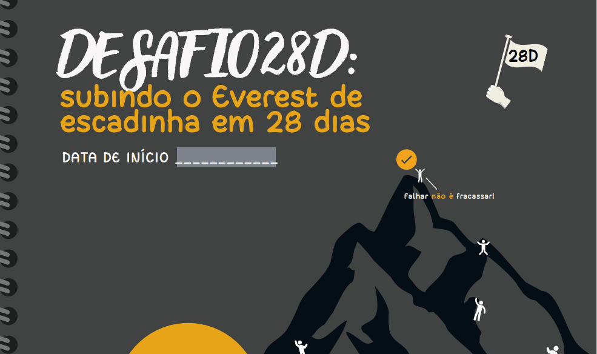

# Nome do meu Projeto 
Descrição do projeto aqui
- De maneira clara e objetiva 🧚🏾

[](https://google.com)

## Tecnologias Utilizadas
- HTML
- CSS
## Como utilizar
- descrever como os usuários podem usar esse projeto

Para Clonar o projeto:
```
escreva o codigo aqui 
```
## Dificuldades que eu tive 
- escrever dificuldades em desenvolver o projeto
